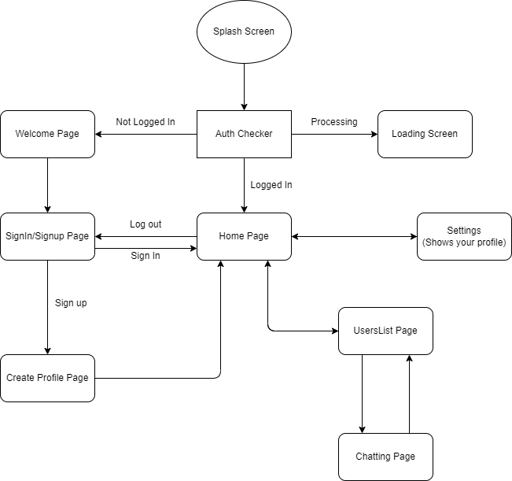
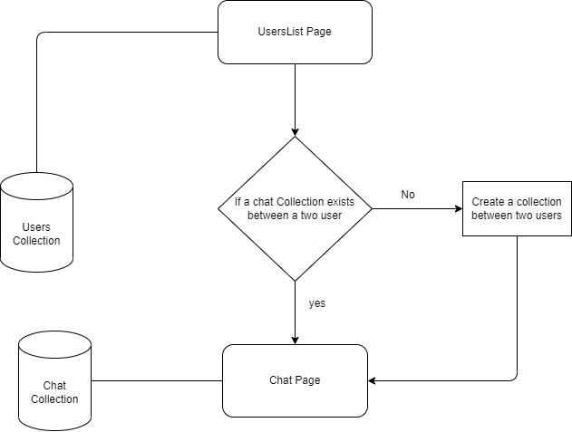

<p  align="center">
<!-- ALL-CONTRIBUTORS-BADGE:START - Do not remove or modify this section -->
[](#contributors-)
<!-- ALL-CONTRIBUTORS-BADGE:END -->
<a  href="https://flutter.dev"  target="_blank"></a> <a>&nbsp;&nbsp;&nbsp;</a>
<a  href="https://appwrite.io"  target="_blank"></a>
</p>

# NO Signal

A functional replica of [_Signal_](https://github.com/signalapp/Signal-Android) (chatting app) made using Flutter and Appwrite.
To know more about it - how it was built and how it works, I have written some detailed blogs on it. Know more about it here: [Part 1](https://bishwajeet-parhi.medium.com/building-no-signal-app-using-flutter-and-appwrite-8b31358b5975) | [Part 2](https://bishwajeet-parhi.medium.com/building-no-signal-using-flutter-and-appwrite-part-2-565c5eb3b484) | [Part 3](https://bishwajeet-parhi.medium.com/building-no-signal-using-flutter-and-appwrite-part-3-90b08db16ec).

## What is Appwrite?

[Appwrite](https://appwrite.io/) is a self-hosted solution that provides developers with a set of easy-to-use and integrate REST APIs to manage their core backend needs.

## Features

- Built on [RiverPod](https://pub.dev/packages/flutter_riverpod) Architecture Pattern
- Authentication using OAuth and OAuth 2.0
- Users can send text to users
- Users can view other Profiles(See their bio and picture)

## Installation

### Appwrite

Appwrite backend server is designed to run in a container environment. Running your server is as easy as running one command from your terminal. You can either run Appwrite on your localhost using docker-compose or on any other container orchestration tool like Kubernetes, Docker Swarm or Rancher.

The easiest way to start running your Appwrite server is by running our docker-compose file. Before running the installation command make sure you have [Docker](https://www.docker.com/products/docker-desktop) installed on your machine:

### Unix

```bash
docker run -it --rm \
    --volume /var/run/docker.sock:/var/run/docker.sock \
    --volume "$(pwd)"/appwrite:/usr/src/code/appwrite:rw \
    --entrypoint="install" \
    appwrite/appwrite:0.14.2
```

### Windows

#### CMD

```cmd
docker run -it --rm ^
    --volume //var/run/docker.sock:/var/run/docker.sock ^
    --volume "%cd%"/appwrite:/usr/src/code/appwrite:rw ^
    --entrypoint="install" ^
    appwrite/appwrite:0.14.2
```

#### PowerShell

```powershell
docker run -it --rm ,
    --volume /var/run/docker.sock:/var/run/docker.sock ,
    --volume ${pwd}/appwrite:/usr/src/code/appwrite:rw ,
    --entrypoint="install" ,
    appwrite/appwrite:0.12.1
```

Once the Docker installation completes, go to <http://localhost> to access the Appwrite console from your browser. Please note that on non-linux native hosts, the server might take a few minutes to start after installation completes.

For advanced production and custom installation, check out our Docker [environment variables](docs/tutorials/environment-variables.md) docs. You can also use our public [docker-compose.yml](https://appwrite.io/docker-compose.yml) file to manually set up and environment.

## Setting up appwrite project

### Flutter

To build and run this project:

1. Get Flutter [here](https://docs.flutter.dev/get-started/install) if you don't already have it
2. Clone this repository
3. `cd` into the repo folder
4. Run `flutter pub get` to get the dependencies
5. Run `flutter run-android` or `flutter run-ios` to build the app

(Please note that a Mac with XCode is required to build for iOS)

### Appwrite

To setup your Appwrite project:

1. Open your browser and go to your <http://localhost>
2. Create your account and login.
3. Click on `Create Project`.
4. Enter a Name and custom Project ID for your project and click create.

At this moment your Dashboard is ready to use.

### Setup Project Dashboard

We need to setup some collections and need to define its attributes so our app will be ready to use.

There are two ways of doing this. First, manually creating a collection from the dashboard and defining the attributes.

Secondly, I have a created a program which does that work for you. All you need is create an API key with all the permissions and replace it in the  `setup_appwrite.dart` files.

Open your terminal in the project folder and run the following commands to setup the **User Collection** . Make sure to replace all the neccessary fields left blank.

```bash
cd lib/utils
dart setup_appwrite.dart
```

Also in `utils` folder create a file called `api.dart` to store all your details in the following way:

```dart
class ApiInfo {
  static const String url = "http://localhost/v1";
  static const String projectId = "[PROJECT_ID]";
  static const String secretKey = "[SECRET_KEY]"; // You can get this from your Appwrite dashboard
  static const String databaseId = "[YOUR_DATABASE_ID]";
}

```

**Now your Project is ready to run.**

## File Structure

```bash
.
├── android # android files
├── assets # assets 
│   ├── images
│   └── lottieassets       
├── ios # android files
└── lib
    ├── api 
    │   ├── auth # Client Authentication
    │   └── database # Database API
    ├── models # Custom Models
    ├── pages
    │   ├── chat
    │   ├── error
    │   ├── home
    │   ├── loading
    │   ├── login
    │   └── settings
    ├── providers 
    ├── utils # Misc tools and stuffs
    └── widgets
```
### App Flow


### Chat architecture


### Screenshots

|    |    |    |
|:-: |:-: |--- |
|    |    |    |
|    |    |     |
|    |    |    |

## Contributors ✨

Thanks goes to these wonderful people ([emoji key](https://allcontributors.org/docs/en/emoji-key)):

<!-- ALL-CONTRIBUTORS-LIST:START - Do not remove or modify this section -->
<!-- prettier-ignore-start -->
<!-- markdownlint-disable -->
<table>
  <tr>
    <td align="center"><a href="https://github.com/kekavc24"><br /><sub><b>kelvin kavisi</b></sub></a><br /><a href="https://github.com/2002Bishwajeet/no_signal/commits?author=kekavc24" title="Code">💻</a></td>
  </tr>
</table>

<!-- markdownlint-restore -->
<!-- prettier-ignore-end -->

<!-- ALL-CONTRIBUTORS-LIST:END -->

This project follows the [all-contributors](https://github.com/all-contributors/all-contributors) specification. Contributions of any kind welcome!